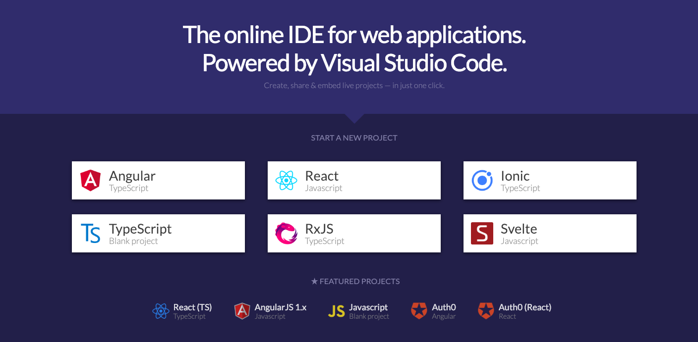
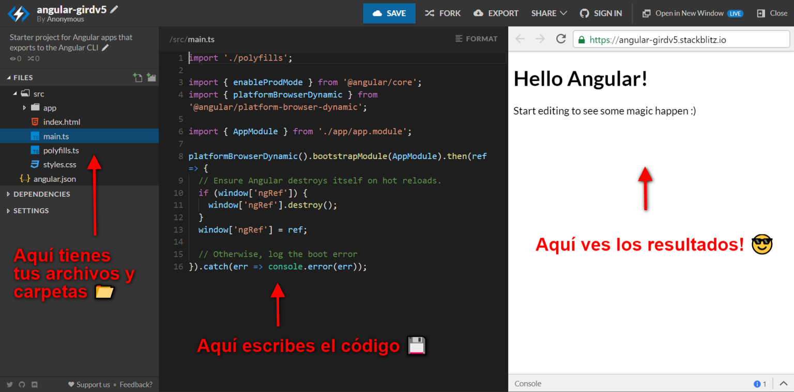

# 2. The tools 🔨

For this workshop we'll use Angular and Firebase, but instead of installing a bunch of packages, tools, and editors, we'll use **Stackblitz 💡**

## What's Stackblitz? 🤔

It's a code editor you don't need to install. It runs on the web browser and handles everything for you.


And when we say everything, **we mean it**. It gives you the editor, installs the packages for you, and even has a view where you can see the result of your app in real-time with live-reload \(_that's just fancy word to say the view updates when you write new code_\).

The first thing you'll need to do is head over to [**https://stackblitz.com/**](https://stackblitz.com/) where you'll see something like this:



You'll head over to **"START A NEW PROJECT"** and click on Angular, it will create a new Angular project for you with all the dependencies. You'll see something like this:



- On the left panel, you'll have the folder structure, you can click on any file there and it will open it for you.
- On the middle panel, you'll see the opened file. That's your code, and every edit you do there we'll appear live in the right panel.
- On the right panel, you'll have a real-time view of your app.

Go ahead, play with it, open the `app.component.html` and change the text inside the `<p></p>` tags to whatever you want, you'll see it updated in real-time in your right panel.

## What about the styles? 💅

The goal for this workshop is to get you comfortable writing code against a cloud backend. We won't focus on styles but since we want everything to look nice we're giving you the **default CSS** for the app.

Go ahead and inside the `app/app.component.css` file paste the following code:

```css
header {
  background: url(https://assets.billboard.com/assets/1544728669/images/charts/header-background/desktop/bb-charts-hot-100.svg?e5261e8a0999849f9cef);
  color: white;
  padding: 1rem 1rem 0.5rem 1rem;
}

header h1 {
  font-family: 'Barlow', sans-serif;
  text-align: center;
  font-size: 3em;
}

header p {
  text-align: center;
  margin: 0.5rem;
}

.card {
  margin: 1rem;
  padding: 0.5rem;
  box-shadow: 2px 2px 10px 1px #888;
  vertical-align: center;
  position: relative;
}

.card input {
  display: inline-block;
  margin: 1rem;
  width: 60%;
  vertical-align: bottom;
}

.card img {
  display: inline-block;
  vertical-align: bottom;
  border: 2px solid rgb(0, 0, 0);
  box-shadow: 2px 2px 11px 1px #888;
}

.card button {
  margin: 0;
  padding: 0;
  position: absolute;
  top: 0;
  right: 0;
}

.add {
  margin: 1rem;
  text-align: center;
}

.add button {
  font-size: 1.5rem;
  font-weight: bold;
}
```

Once you're ready, move to the next step, where you'll learn how to **connect Firebase** with your Angular app.
