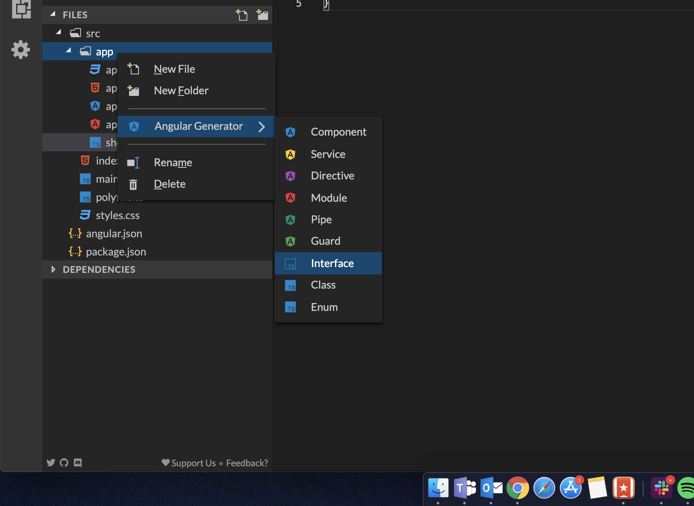

# 4. Storing information 💻

In the previous lesson, we connected our app to **Firebase**. Now it's time to start writing content into the database, for that we need a couple of things:

1. 👉 A form that lets us write the content
2. 👉 A function that takes that content and sends it to Firestore
3. 👉 A way of knowing the content was saved successfully

With that in mind let's begin with **\#1.** We want to create a button that once clicked, generates a new TVShow card for us and stores the information inside the **Firestore Database**.

The first thing we'll do is create the button in our `app.componente.html` file. Go ahead and **replace its contents** with this:



```markup
<header>
  <h1>TV SERIES!</h1>
  <p>📺 Your favorite TV Shows 📺</p>
</header>

<div class="add">
  <button (click)="add()">ADD</button>
</div>
```



We're adding a page title and a button. When clicked, the button will call the `add()` function inside our `app.component.ts`. You're probably thinking, "_but I don't have an add\(\) function..._". You are right,  and we're going to create it right away 👌


TypeScript is great because it lets us define types for our objects, that way we get better editor integration with auto-complete or detect syntax errors on the spot!


First, we'll do a bit of house keeping, we want to create a type for our TV Shows, that way every part of our app knows exactly how a TV Show looks like. To create that type, we'll use the **Angular Generator**, go ahead and right-click on the `app/` folder, go to **Angular Generator** and click on **Interface** as shown in the image below:



* Name your interface `show`.
* The file name should be **show.interface.ts**, if it isn't you can right click it and rename it.

Once that's done, let's add the properties we want inside the interface. A show should have an ID, a name, and a picture, so open `show.interface.ts` and replace its contents with this:



```typescript
export interface Show {
  id: string;
  name: string;
  picture: string;
}
```



Now we can go to our `app.component.ts` file and start creating our apps functionality. The first thing we need to do is to import everything we'll need inside the file:



```javascript
import { Component } from '@angular/core';
import { Observable } from 'rxjs';
import { Show } from './show.interface';
import { AngularFirestore, AngularFirestoreCollection } from '@angular/fire/firestore';
```



We're importing:

* `Observable` because Firebase services return Observables and we want to use correct types.
* `Show` because our Observables are going to be of type `Show` \(_remember the Interface we just created_\).
* `AngularFirestore` to be able to interact with our Firestore database.
* `AngularFirestoreCollection` because that's the type Firestore collections use.

After that we'll create 2 class properties, right before our `constructor()`:



```typescript
showCollection: AngularFirestoreCollection<Show>;
showList: Observable<Show[]>;
```



We're creating:

* `showCollection` as a reference to the Firestore collection where our data will be stored.
* `showList` this is the list that will hold all of our shows and lets us display them in the page.

Then we need to initialize everything inside our `constructor()`:



```javascript
constructor(private db: AngularFirestore) {
  this.showCollection = db.collection('shows');
  this.showList = this.showCollection.valueChanges();
}
```



* With `this.showCollection = db.collection('shows');` we are creating a reference to a Firestore collection called **shows**, think of it as creating a direct route to the place where we'll store our TV Shows.
* And then `this.showList = this.showCollection.valueChanges();` is taking that reference and transforming it into an `Observable` which is a list we can then display on the page.


**DON'T USE 'SHOWS'  ❌**

Think about it, if everyone is connecting to the same database using the same collection, it will be a mess, a fire-mess 🔥

So make sure to **use another name** for your collection, for example: **juan\_shows**



```javascript
constructor(private db: AngularFirestore) {
  this.showCollection = db.collection('juan_shows');
  this.showList = this.showCollection.valueChanges();
}
```




Now it's time to create the actual `add()` function. Remember, our `TVShow` has 3 properties: an ID, a name, and a picture, so we need to send those 3 properties to Firestore. Go ahead and after our `constructor()` add:



```javascript
add() {
  const id = this.db.createId();
  const picture = this.getRandomPicture();
  const name = '';
  this.showCollection
    .doc(id)
    .set({ name, picture, id });
}

getRandomPicture() {
  const randomNumber = Math.round(Math.random() * 20);
  return 'https://picsum.photos/100/100?image=' + randomNumber;
}
```




**What is getRandomPicture\(\)?**

It is a function that generates random images from an API \([**picsum.photos**](https://picsum.photos/)\). It passes random numbers to generate random links. Then returns them as a URL that we can pass to any **&lt;img&gt;** tag 😃



Now, let's dissect the `add()` function line by line:

* 👉 First, we're using `const id = this.db.createId()` to create a new random ID for our show, then assign that ID to the `id` variable.
* 👉 Second, we're using `const picture = this.getRandomPicture()` to create an image link and assign it to the `picture`variable.
* 👉 We're setting the name variable to an empty string with `const name = ''`.
* 👉 Then we're going into our `showCollection` reference and with `.doc(id)` we're saying, "_hey, from that show list go into this specific show_".
* 👉 And lastly we're using `.set({ name, picture, id })` to set the properties inside the object.

## We're almost there! 💪 Hang on!

We just connected our app with Firebase, and it is sending values to our database. The last step is to display them! Almost there! 😱


