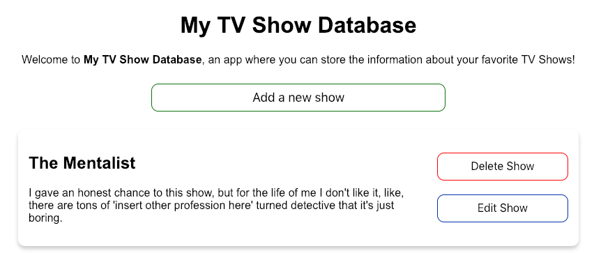
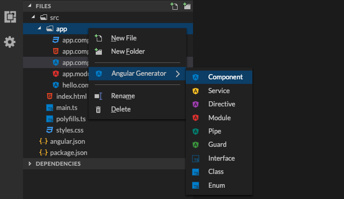

# Reading objects from our database

In the previous lesson, we learned how to store data in Firestore. Now, it's time to learn how to read that data and display it inside our application.

This time we're going to do things a little different, instead of starting with the logic, we're going to start with the view, even if we need to hardcode the data, and then replace it with dynamic data.

We'll work like this because we want you to have feedback from the beginning, and be able to see what you're building.

The idea is to show a list of cards, and inside each card have the show's information, by the end of the lesson you should have something like this:



## Creating the CardComponent

Let's start with creating a component for our cards, open the **Angular Generator** and add a new component called **card**



Now go into the `app.component.html` file and add this to the end:

```html
<app-card></app-card>
```

We're adding our card component to the app component, this will render the card just like it rendered the form.

Now let's move to the `card.component.html`, the idea is to have a card that displays the show's information and two buttons, a button to delete the show from our database and a button to edit the show's information:

```html
<div class="card">
  <div class="show-info">
    <h2 class="title">The Mentalist</h2>
    <p class="description">
      I gave an honest chance to this show, but for the life of me I don't like it, like,
      there are tons of 'insert another profession here' turned detective that it's just
      boring.
    </p>
  </div>

  <div class="show-actions">
    <button (click)="deleteShow()" class="button delete">Delete Show</button>
    <button (click)="editShow()" class="button edit">Edit Show</button>
  </div>
</div>
```

We're hardcoding the data because we want you to see the card in your app's view immediately, then we'll start replacing that data with the data from the Firestore database.

Now, move to the `add.component.css` file and add the styles:

```css
.card {
  display: flex;
  flex-direction: row;
  justify-content: space-between;
  align-items: center;
  font-family: 'Arial';
  box-shadow: 0 4px 8px 0 rgba(0, 0, 0, 0.2);
  padding: 15px;
  border-radius: 10px;
  margin: 20px;
}

.show-info {
  width: 75%;
  margin-right: 20px;
}

.show-actions {
  width: 25%;
  text-align: center;
}

.button {
  width: 100%;
  height: 40px;
  border-radius: 10px;
  background-color: #ffffff;
  color: #000000;
  text-align: center;
  text-decoration: none;
  font-size: 16px;
  margin: 10px 0;
}

.delete {
  border: 1px solid #ff0000;
}

.edit {
  border: 1px solid #0037b1;
}
```

Same as before, we're adding margins, padding, colors, and borders, just trying to make our app look nice.

## Adding the logic

Now that we can see our card in action, it's time to start plugin in our database, the first thing we want to do is to go inside the `card.component.ts` file and add the imports we need to the top of the file:

```javascript
import { Component, OnInit, Input, Output, EventEmitter } from '@angular/core';
import { FirebaseService } from '../firebase.service';
import { TVShow } from '../show-interface';
```

By now you should recognize all of those imports since we used them in the previous component, but if you have any questions about them remember that we're all here for you and you can ask us as many questions as you want :-)

Now, right before the constructor we'll add the component's inputs:

```javascript
@Input() showName: string;
@Input() showDescription: string;
@Input() showId: string;
```

An `@Input()` decorator tells our component that those variables will be passed from the parent component.

And that's it for now, we can move to the `app.component` file where we'll fetch the show list from Firestore and add those inputs to our card component.

The first thing we want to do is to go inside the `app.component.ts` file and add a new class property (_right before the constructor_) and inject our Firebase service:

```javascript
public tvShowList: Observable<TVShow[]>;
public showForm = false;

constructor(private firebaseService: FirebaseService) {}
```

The `tvShowList` property will hold our TV shows, and we're declaring it to be an Observable of type `TVShow[]` (_Or an array of TV Shows_).

Now, let's call the `.getShowList()` function from our Firebase service and assign the result to our `tvShowList` property.

```javascript
public tvShowList: Observable<TVShow[]>;
public showForm = false;

constructor(private firebaseService: FirebaseService) {
  this.getShowList();
}

getShowList(): void {
  this.tvShowList = this.firebaseService.getShowList();
}
```

It's showing you an error because we haven't created the `getShowList()`, so go ahead and open `firebase.service.ts` and let's create the function there:

```javascript
public getShowList(): Observable<TVShow[]> {
  return this.tvShowCollection.valueChanges();
}
```

This function is taking the `tvShowCollection` Collection and attaching the method `.valueChanges()` to transform it into an observable, and then it's returning its value.

If you move back to `app.component.ts` you'll notice that the error is gone.

Our next move is to replace the hardcoded that with the data our database is returning, for that we have to edit 2 files, the `app.component.html` file, and the `card.component.html` file.

Let's start with the `app.component.html` file, find the card initialization that looks like this:

```html
<app-card></app-card>
```

And replace it with this:

```html
<app-card
  *ngFor="let item of tvShowList | async"
  [showName]="item.showName"
  [showDescription]="item.showDescription"
  [showId]="item.showId"
></app-card>
```

Here's what's going on:

- We're using the `*ngFor` directive to tell our component it's going to loop through the `tvShowList` Observable.
  - We're adding the `| async` pipe to tell `*ngFor` that this is an async operation.
- We're passing the inputs our component takes (_id, name, and description_).

And lastly we need to go into the `card.component.html` file and make it look like this:

```html
<div class="card">
  <div class="show-info">
    <h2 class="title">{{ showName }}</h2>
    <p class="description">{{ showDescription }}</p>
  </div>

  <div class="show-actions">
    <button (click)="deleteShow()" class="button delete">Delete Show</button>
    <button (click)="editShow()" class="button edit">Edit Show</button>
  </div>
</div>
```

And that's it, right now your app should be showing the card(s) showing the information of the TV Show(s) you added to the database :-)

Once you're ready let's move to the next part where we'll start giving functionality to those buttons inside the card for updating and deleting TV Shows.
