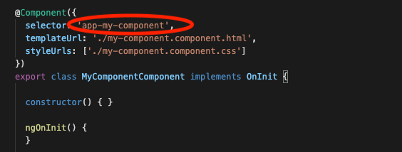

# 7. Brownie Points 🍩

First of all, congratulations, we're really happy you finished the workshop, and we all hope you learned a lot :-\)

* If you're up for it, there's one change we want you to do to the app, and it's about making it modular, more maintainable using Angular Components.
* A component is the basic building block in an Angular application. You can extract functionality into a component and then re-use it throughout your app.
* For example, let's say you have a list of items inside your app, but then you realize you need that list somewhere else, would you copy/paste the list in the new place? Leaving you with two \(_or more_\) lists to maintain?
* What we should do there is create the list as a component, and then use that component everywhere we need the list, that way we're maintaining one list and using it everywhere we want to.

To create a component you'll use the **Angular Generator** inside Stackblitz, the same way you created the interface, but clicking on **Component** instead


* Once the component is created you get a new folder with several files, an HTML, a CSS, and a TS file, to handle the view, the styles, and the logic of that component.
* You'll move the functionality's logic to that component, and then you can use it anywhere inside your app, to use it you'll want to find the component's selector.

Inside the components TypeScript file look for the `@Component()` decorator, the selector is there:



All you need to do is to call the selector inside your app:

```markup
<header>
  <h1>TV SERIES!</h1>
  <p>📺 Your favorite TV Shows 📺</p>
</header>

<div class="add">
  <button (click)="add()">ADD</button>
</div>

<tv-show-card></tv-show-card>
```

Now try it yourself, go ahead and transform our card into a component and then render it on the screen. You can choose the name you want for the component and add whatever new functionality you can think of :-\)

Remember, don't be shy or afraid to ask questions, the mentors are here for you!


